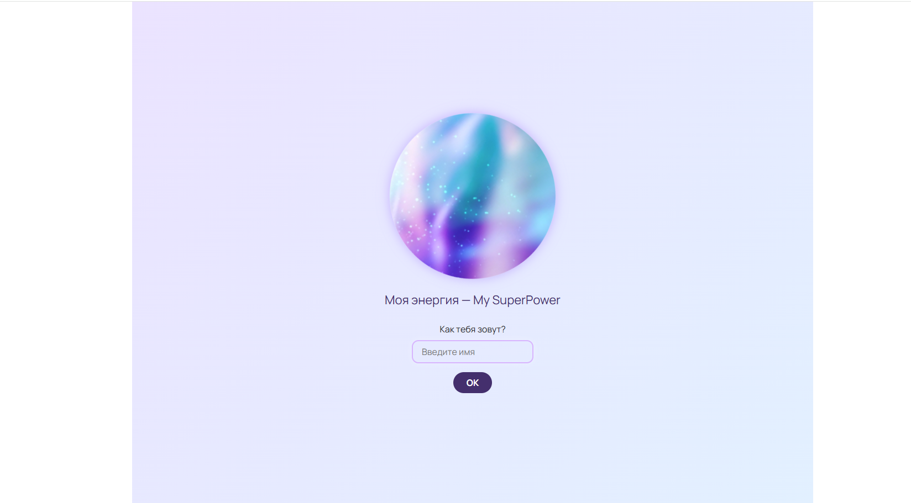
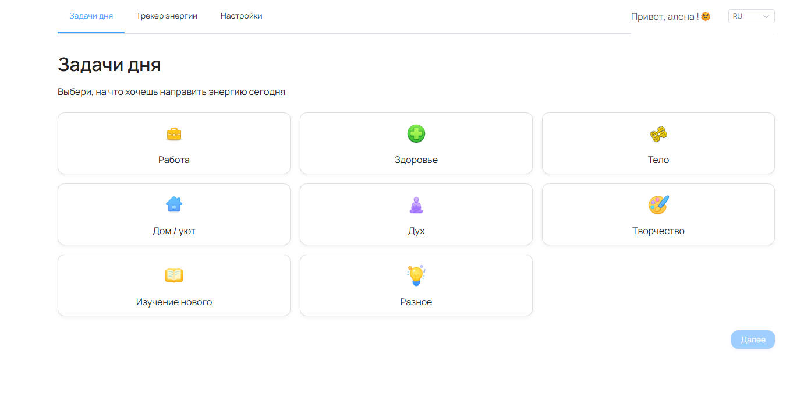
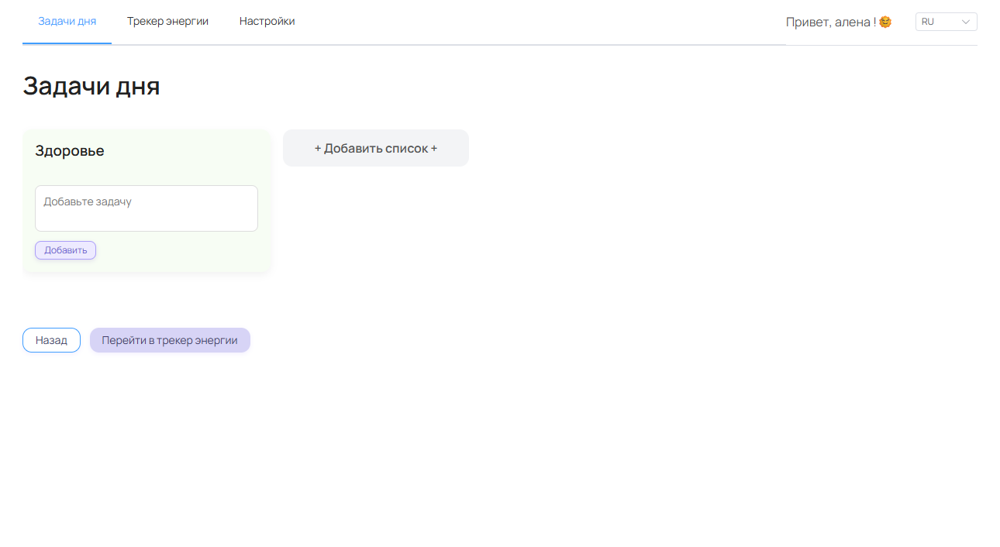
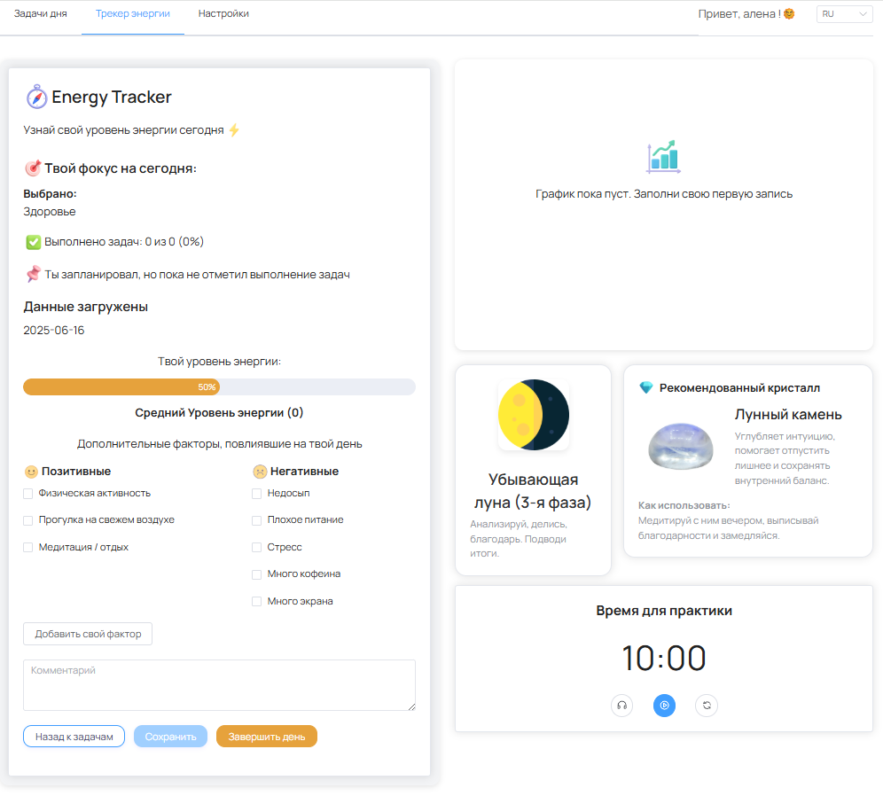

# 🌟 Осознанная доска энергии (Energy Focus Tracker)

Живой интерфейс для настройки внимания, действий и энергии на каждый день.


## 🚀 О проекте

**Energy Focus Tracker** — это современный трекер состояния и “энергетическая Trello-доска” в одном флаконе.  
Утром — выбираешь фокусы (работа, дух, тело и др.), в течение дня — планируешь задачи по направлениям,  
вечером — отслеживаешь, что реально дало тебе энергию.

- Осознанное распределение энергии
- Учет индивидуальных фокусов дня
- Лёгкая визуализация и мотивация без выгорания

---

## ⚙️ Технологии

- Vue 3 + Composition API
- TypeScript
- Pinia
- Element Plus (UI)
- vue-i18n(мультиязычность)
- Chart.js (график)
- Supabase (бэкенд/БД)
- Flat-дизайн: пастельные цвета, мягкое свечение, эмодзи

---

## 🛠️ Установка и запуск

```bash
git clone 
cd energy-tracker
yarn
yarn dev


## 📸 Скриншоты

### 1. Первый экран — приветствие и ввод имени


### 2. Выбор фокусов дня


### 3. Доска задач на день


### 4. Трекер энергии и анализ дня


*Когда вы заполните свой первый день, появится график энергии, а также рекомендации по лунному циклу и кристаллам.*

🌙 Особенности
Осознанный подход: каждый день можно выбирать, куда направить энергию

Визуализация изменений состояния на графике

Поддержка кастомных списков и своих “энергетических факторов”

Рекомендации: фазы луны, кристаллы, индивидуальные подсказки

Мультиязычность (RU/EN)

